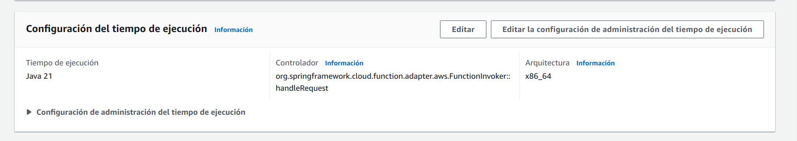
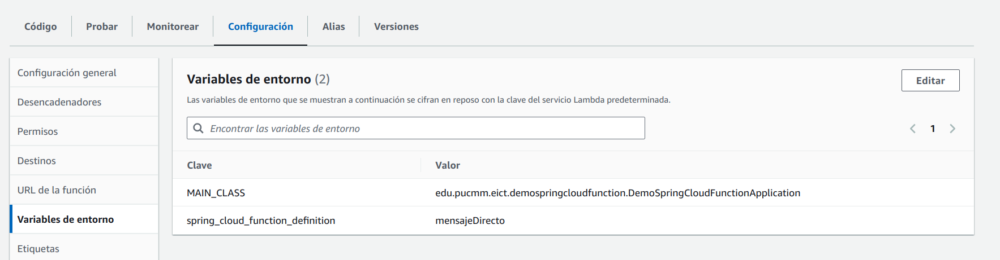
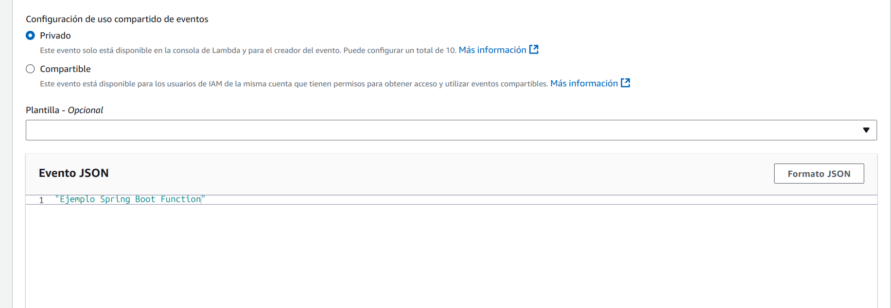
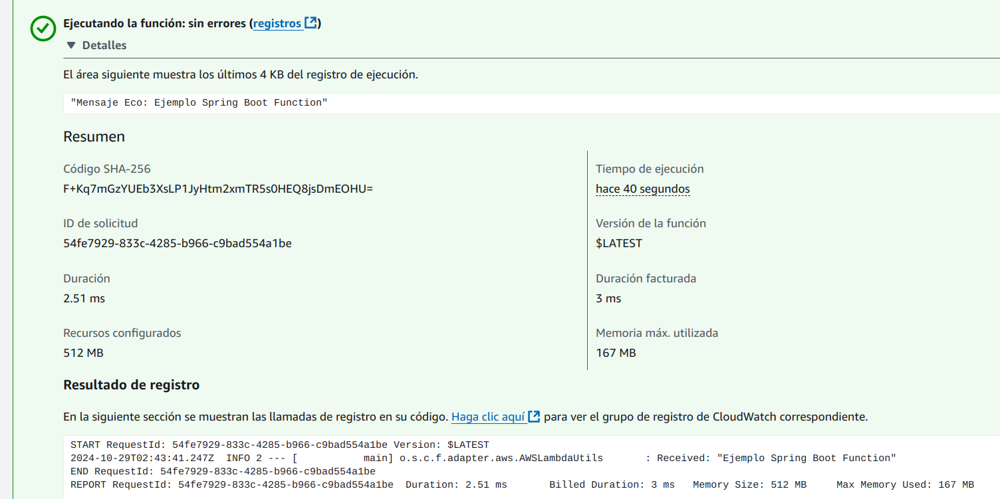

# Proyecto Demostración Spring Cloud Function

Utiliza el framework de Spring Cloud para el manejo de funciones serverless.
Para nuestro caso estamos trabajando adaptado con AWS Lambda. Las funcionalidades disponible:

- Interfaz Function: [HolaMundoFuncion](src/main/java/edu/pucmm/eict/demospringcloudfunction/funciones/HolaMundoFuncion.java)
- Interfaz Consumer: [HolaMundoConsumer](src/main/java/edu/pucmm/eict/demospringcloudfunction/funciones/HolaMundoConsumer.java)
- Interfaz Supplier: [HolaMundoSupplier](src/main/java/edu/pucmm/eict/demospringcloudfunction/funciones/HolaMundoSupplier.java)
- Interfaz ApiGateway: [FuncionApiGateway](src/main/java/edu/pucmm/eict/demospringcloudfunction/funciones/FuncionApiGatewayAws.java)

Para compilar el proyecto:

`./gradlew shadowjar`

Para crear el servicio, realizar los siguientes pasos:

## Versión de la aplicación

- Spring Boot 3.3.5
- Java 21
- Spring Cloud Function -> versión 2023.0.3

## Configurar en AWS

Una vez cargado el jar en en la función de AWS, debemos configurar el controlador
con el siguiente valor ```org.springframework.cloud.function.adapter.aws.FunctionInvoker::handleRequest```
y en las variables de entornos crear la entrada ```spring_cloud_function_definition = mensajeDirecto``` y 
``` MAIN_CLASS = edu.pucmm.eict.demospringcloudfunction.DemoSpringCloudFunctionApplication```. Ver imagenes:






Para la prueba, puede crear un JSON de tipo String:





Ver más información en: https://docs.spring.io/spring-cloud-function/reference/adapters/aws-intro.html